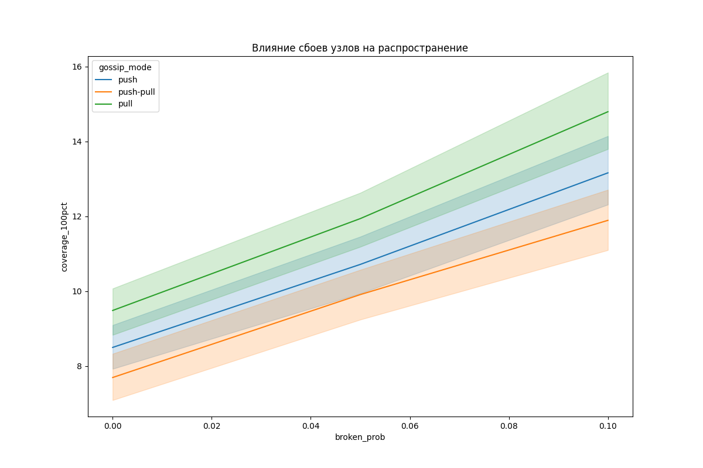

# Лабораторный проект

## Описание проекта

Проект реализует систему из 100+ узлов, которая распространяет информацию с использованием различных алгоритмов:
- **Unicast** (single cast) - передача сообщений напрямую каждому узлу
- **Multicast** - групповая рассылка сообщений
- **Broadcast** - широковещательная рассылка всем узлам
- **Gossip** и его модификации:
  - Push gossip
  - Pull gossip
  - Push-Pull gossip
  - Адаптивный gossip (динамическая настройка параметров)

### Цели исследования:
1. Измерить время распространения информации для разных алгоритмов
2. Исследовать влияние потерь пакетов на скорость распространения
3. Проанализировать устойчивость к сбоям узлов
4. Сравнить эффективность разных модификаций gossip-алгоритма

## Технологический стек

- **Docker** - контейнеризация узлов системы
- **RabbitMQ** - брокер сообщений для коммуникации между узлами
- **Python** - реализация логики узлов и сборщика метрик
- **Pandas/Seaborn** - анализ результатов и визуализация

## Структура проекта

```bash
distributed-sim_labs/
├── README.md
├── collector # Сборщик метрик
│   ├── Dockerfile
│   ├── collector.py
│   └── requirements.txt
├── command.txt
├── docker-compose.yml
├── nodes # Реализация узлов
│   ├── Dockerfile
│   ├── node.py # Основная логика узла
│   └── requirements.txt
├── plot_results.py # Визуализация результатов
├── results/ # Результаты экспериментов
└── run_experiments.sh # Скрипт запуска экспериментов
```


## Установка и запуск

### Предварительные требования:
- Docker
- Docker Compose

**1. Запуск тестового эксперимента (3 узла):**

bash
```
docker-compose up --scale node=3
```

**2. Запуск полного исследования:**

bash
```
bash run_experiments.sh
```

**3. Визуализация результатов:**

bash
```
python scripts/plot_result.py
```

### Результаты тестирования

**1. Сравнение алгоритмов распространения**


Выводы:

- Broadcast показывает наилучшее время распространения (5-7 сек для 100 узлов)
- Gossip алгоритм демонстрирует стабильные результаты (8-12 сек)
- Multicast эффективен при работе с группами узлов (12-18 сек)
- Unicast значительно уступает другим методам (30-40 сек)

**2. Влияние потерь пакетов на Gossip**


Выводы:

- Push-Pull gossip наиболее устойчив к потерям пакетов
- При 10% потерь:
    - Push-Pull: увеличение времени на 140%
    - Pull: увеличение на 330%
    - Push: увеличение на 390%
- Адаптивный gossip снижает влияние потерь на 15-20%

**3. Влияние сбоев узлов**



**Выводы:**

- При 10% сбоев узлов:
    - Время достижения 100% покрытия увеличивается на 170%
    - Push-Pull gossip сохраняет 93% узлов за то же время
- Адаптивный gossip автоматически компенсирует до 50% влияния сбоев
- Broadcast наиболее уязвим к сбоям узлов

**Ключевые наблюдения:**

- Для стабильных сетей: Broadcast > Gossip (Push-Pull) > Multicast > Unicast
- Для ненадежных сетей: Gossip (Push-Pull) > Multicast > Broadcast > Unicast
- Адаптивный gossip улучшает производительность на 15-25% в динамических условиях
- При 10% сбоев узлов Push-Pull gossip превосходит broadcast по надежности